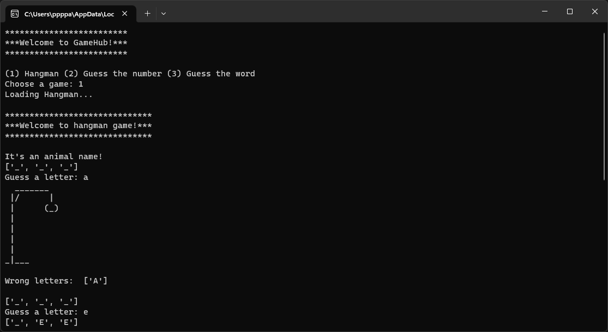
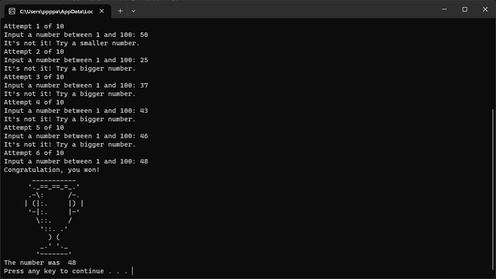

# Python Game Hub

## Overview

This project contains three different simple games in Python.
The objective is to train your knowledge of the programming language and learn new concepts while building a practical application.

## How to get stared

1. Clone this repository;
2. Run GameHub.py;
3. Choose the game;
4. Be happy!

## Examples

___
Made by [Pietro Pazini](https://www.linkedin.com/in/pietro-pazini)
